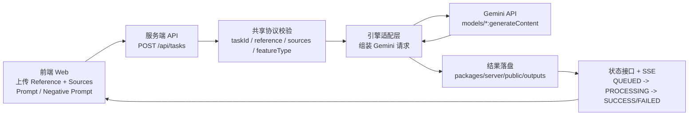

# Nano Banana Editor

Nano Banana Editor 是一个基于 MEIE（Multi-Element Image Engine）思路实现的多图融合生成编辑器。

## 项目结构

```text
Nano Banana Editor/
├── packages/
│   ├── web/       # 前端页面（上传、角色配置、状态预览）
│   ├── server/    # 任务 API、SSE 状态推送、静态资源服务
│   ├── shared/    # 前后端共享协议与校验逻辑
│   └── engine/    # Gemini 图像生成适配层（Nano Banana Pro）
├── docs/
│   └── technical-plan.md
├── package.json
└── pnpm-workspace.yaml
```

## 技术栈

- 运行时：Node.js（ESM）
- 前端：原生 HTML / CSS / JavaScript
- 后端：Node `http` + SSE（无框架）
- 协议层：`packages/shared` 自定义结构校验
- 生成后端：Gemini API `generateContent`（`packages/engine`）
- 仓库形态：Monorepo（`pnpm-workspace.yaml` + npm workspaces）

## featureType 说明

`featureType` 是项目内部的语义标签（不是 Gemini 官方枚举），用于指导多 Source 特征整合时的提示词编排。

| featureType | 作用 | 典型场景 |
| --- | --- | --- |
| `FACE` | 保持人脸/身份一致性 | 人像角色一致性 |
| `STYLE` | 迁移整体视觉风格 | 色调、渲染风格、摄影风格 |
| `MATERIAL` | 迁移材质与纹理细节 | 金属、布料、食物表面纹理 |
| `COMPONENT` | 迁移可替换部件/主体特征 | 主体替换、配件/零件整合 |

## 架构图



## 快速启动

```bash
export GEMINI_API_KEY="your_key"
# 可选：
# export GEMINI_MODEL="gemini-3-pro-image-preview"
# export GEMINI_API_BASE_URL="https://generativelanguage.googleapis.com/v1beta"
node packages/server/src/index.js
```

打开：

- `http://127.0.0.1:8787`

## 基础校验

```bash
node scripts/check.js
# 远程校验（会实际调用 Gemini API）：
# CHECK_REMOTE=1 node scripts/check.js
```
